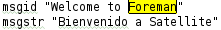
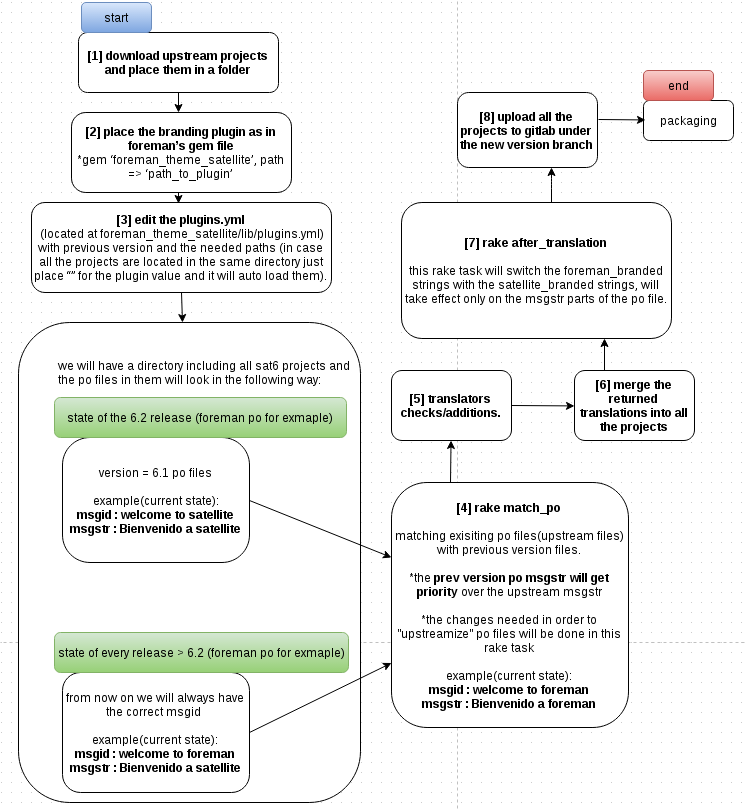

## ForemanThemeSatellite

### Goals:
1. Make downstream release automated.
2. Have the same code base for all upstream/downstream projects.
3. Create one place to insert all the changes from upstream to downstream (1 project changes vs all projects).
4. Usage of downstream translations for upstream use.

### Needed changes:
Moving from upstream to downstream (from branding perspective) require some changes:

1. images/logos, css.
2. functionality. (overriding provider_friendly_name of compute resources - e.g. openstack model to return “RHEL OPENSTACK PLATFORM” instead of “OPENSTACK”)
3. views.(adding red hat logo on login page)
4. strings, using satellite_branded strings instead of foreman_branded (foreman,smart-proxy..etc).

Example:

   

## Usage:

1) Run-time dependency:
  * The plugin uses deface (app/overrides/satellite_name_override.rb) for replacing branded views.
  * Monkey-patching for replacing branded functions.
  * Changing assets load order to prioritize loading plugin’s branded assets instead of foreman’s upstream ones.

2) Internal-tool:
  * The plugin uses i18n functionality in order to switch foreman_branded strings (that were replaced in code) with satellite_branded strings.
  In order to understand how the plugin works it’s first needed to understand i18n functionality: each language has a .po file with paris of
  msgid/msgstr which is used like a dictionary.(use as an internal tool at the rebase process)

Basic exmaple:

   

   to =>

   


## Overrides: (Run-time dependency use)

### CSS:

Create a new file with the same name as the css you want to override. At the top of the new file add “@import <%= Rails.root %>/app/assets/stylesheets/*filename”.Then write your own css rules and it will override the core ones.

For example patternfly_and_overrides.scss override (changing the body width) :

```sass
@import "mixin";
@import "colors";
@import  "<%= Rails.root %>/app/assets/stylesheets/patternfly_and_overrides.scss";

$navbar-default-bg: $primary_color;

body {
  width: 100%;
}
```


### Images/logos:

Add a file to the assets/images with the same name as the image you want to override.


### Change-views/layouts:

Use [deface](https://github.com/spree/deface) in order to change views, all the deface changes are located under app/overrides.

For example, adding the redhat logo to the login screen

```ruby
Deface::Override.new(:virtual_path  => "users/login",
                     :name          => "add redhat logo",
                     :insert_before => "div#login",
                     :text          => "<span id='badge'><%= image_tag('Redhat-logo.png') %></span>")
```


### Change controller/models behaviour:

Use [Monkey-patching](http://culttt.com/2015/06/17/what-is-monkey-patching-in-ruby/) in order to change functionality:

* Create a moudle with the overrided method

```ruby
module Openstack
  extend ActiveSupport::Concern
  included do
    define_singleton_method :provider_friendly_name do
      "RHEL OpenStack Platform"
    end
  end
end
```

* Include the model inside the engine.

```ruby
config.to_prepare do
      Rails.application.config.sass.load_paths << "#{engine_peth}/app/assets/stylesheets"
      assets_to_override = [
                             "#{engine_peth}/app/assets/stylesheets",
                             "#{engine_peth}/app/assets/images",
                             "#{engine_peth}/app/assets/javascripts"]
      assets_to_override.each { |path| Rails.application.config.assets.paths.unshift path }
      begin
        # Include your monkey-patches over here
        Foreman::Model::Openstack.send :include, Openstack
      rescue => e
        puts "ForemanThemeSatellite: skipping engine hook (#{e.to_s})"
      end
    end
```

### Helpers:

Adding a helper function with the same name as in foreman core in application_helper will override it.

Documentation override was made using this method

### Documentation:

Foreman's documentation is processed thorugh `documentation_url` fucntion,
by overrding it from foreman_theme_satellite/app/helpers/theme_application_helper we change the documentation links.

Connect each subject with the current links: (this is the entery point for documentation team)

```ruby
USER_GUIDE_DICTIONARY = {
    "InstallationMedia" => "https://access.redhat.com/documentation/en-US/Red_Hat_Satellite/#{ ForemanThemeSatellite::SATELLITE_SHORT_VERSION}/html/User_Guide/sect-Installation_Media.html"
    }
```


### Versioning:

The versions are controlled by lib/foreman_theme_satellite/version.rb,

```ruby
module ForemanThemeSatellite
  VERSION = "0.1"
  #this file indicates the satellite version that will be represented on the login page.
  SATELLITE_VERSION = "SATELLITE-6.1.0"
  #this file indicates the satellite version that will be uesd on links to documentation.
  SATELLITE_SHORT_VERSION = "6.0"
end
```

### Tests:

Dou to all the changes the plugin makes it is possible that some of the core tests will fail,
we solve that by skipping the test and replacing it with our own.

Skipping :

```ruby
initializer 'foreman_theme_satellite.register_plugin', :after=> :finisher_hook do |app|
      Foreman::Plugin.register :foreman_theme_satellite do
        requires_foreman '>= 1.10'
         tests_to_skip ({
                        "ComputeResourceTest" => ["friendly provider name"]
                        })
end
```

Replacing :

```ruby
class ModelsTest < ActiveSupport::TestCase

  test "check openstack friendly name" do
    assert_equal Foreman::Model::Openstack::provider_friendly_name, "RHEL OpenStack Platform", "Friendly name override was unsuccessful"
  end

end
```


## Rebase process: (Internal-tool use)
1. download all the upstream projects + branding plugin(place them in the same dir).
2. place the branding plugin in foreman’s gem file.
           * gem ‘foreman_theme_satellite’, path => ‘path_to_plugin’
3. edit the plugins.yml (located at foreman_theme_satellite/lib/plugins.yml) with the needed paths(in case all the projects are located in the same directory just place “” and it will auto load them) and version.
4. run `rake match_po` from the foreman directory.
5. send po files for translations.
6. once translations are back, merge them to each project(this might be a good point to upload them for upstream use).
7. run `rake after_translation` from the foreman directory.
8. upload all the projects to a new gitlab under the new version branch.

**Editing the plugin.yaml**

```yaml
#previous_version is the version should state last version of satellite.
:previous_version: "SATELLITE-6.1.0"
:plugins:
  foreman: ""
  #this will look for the project in ../
  hammer-cli: ""
  #this will look for the project in that path
  foreman_docker: "../example/foreman-docker"

```




## Benefits of the new branding:
* Creating a downstream version **can now be automated**.
* Same code base for all upstream/downstream projects, **only difference is in locales**.
* Foreman_theme_plugin is the **only place** to insert bradning changes from upstream to downstream.
* Downstream translators are **working on upstream translations**, we can upload them for upstream use, translations will be easy to merge.


## Check and experiment
* git clone git@gitlab.sat.lab.tlv.redhat.com:satellite6/foreman_theme_satellite.git
* add this plugin as a gem in your foreman gemfile.
* to get the rails server to have satellite_branded strings, run `rake after_translation`
