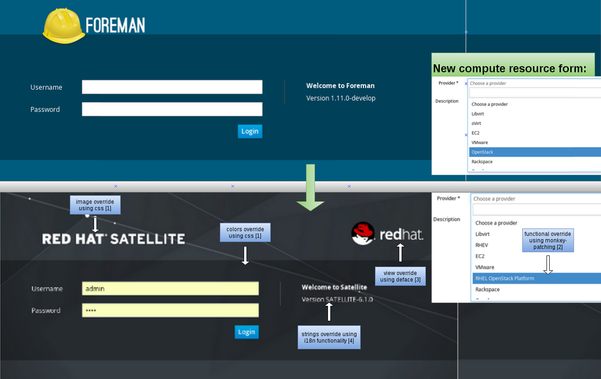

## ForemanThemeSatellite

### Goals:
1. Make downstream release automated.
2. Have the same code base for all upstream/downstream projects.
3. Create one place to insert all the changes from upstream to downstream (1 project changes vs all projects).
4. Usage of downstream translations for upstream use.

### Needed changes:
Moving from upstream to downstream (from branding perspective) requires some changes:

1. images/logos, css.
2. functionality. (overriding provider_friendly_name of compute resources - e.g. openstack model to return “RHEL OPENSTACK PLATFORM” instead of “OPENSTACK”)
3. views.(adding red hat logo on login page)
4. strings, using satellite_branded strings instead of foreman_branded (foreman,smart-proxy..etc).

Example:

   

## Usage:

* The plugin uses deface (app/overrides/satellite_name_override.rb) for replacing branded views.
* Monkey-patching for replacing branded functions.
* Changing assets load order to prioritize loading plugin’s branded assets instead of foreman’s upstream ones.
* The plugin uses fast_gettext's [repository](https://github.com/grosser/fast_gettext/wiki/Howto:-Extending-FastGettext-with-custom-translation-repository) functionality in order to switch foreman_branded strings (marked for translation) with satellite_branded strings.

## Overrides:

### CSS:

Add a file to `app/assets/stylesheets/satellite` and name it as you like (the recommendation is to name it according to the component being modified)

Set the rules that you want to override
Example: `app/assets/stylesheets/satellite/wizard.scss`

```scss
.wizard li {
  padding: 8px 12px 8px;

  &:first-child {
    -webkit-border-radius: 0;
    -moz-border-radius: 0;
    border-radius: 0;
  }
  &:last-child {
    -webkit-border-radius: 0;
    -moz-border-radius: 0;
    border-radius: 0;
  }
}
```

### Images/logos:

Add a file to the assets/images with the same name as the image you want to override.


### Change-views/layouts:

Use [deface](https://github.com/spree/deface) in order to change views, all the deface changes are located under app/overrides.

For example, adding the redhat logo to the login screen

```ruby
Deface::Override.new(:virtual_path  => "users/login",
                     :name          => "add redhat logo",
                     :insert_before => "div#login",
                     :text          => "<span id='badge'><%= image_tag('Redhat-logo.svg') %></span>")
```


### Change controller/models behaviour:

Use [Monkey-patching](http://culttt.com/2015/06/17/what-is-monkey-patching-in-ruby/) in order to change functionality:

* Create a module with the method you want to override

```ruby
module Openstack
  extend ActiveSupport::Concern
  included do
    define_singleton_method :provider_friendly_name do
      "RHEL OpenStack Platform"
    end
  end
end
```

* Include the model inside the engine.

```ruby
config.to_prepare do
  begin
    # Include your monkey-patches over here
    Foreman::Model::Openstack.send :include, Openstack
  rescue => e
    puts "ForemanThemeSatellite: skipping engine hook (#{e.to_s})"
  end
end
```

### Helpers:

Adding a helper function with the same name as in foreman core in application_helper will override it.

Documentation override was made using this method

### Documentation:

Foreman's documentation is processed through `#documentation_url` function,
by overriding it from `app/helpers/theme_application_helper.rb` we change the documentation links.

Connect each subject with relevant links: (this is the entry point for documentation team)

```ruby
USER_GUIDE_DICTIONARY = {
    "InstallationMedia" => "https://access.redhat.com/documentation/en-US/Red_Hat_Satellite/#{ ForemanThemeSatellite::SATELLITE_SHORT_VERSION}/html/User_Guide/sect-Installation_Media.html"
    }
```


### Versioning:

The versions are controlled by `lib/foreman_theme_satellite/version.rb`,

```ruby
module ForemanThemeSatellite
  VERSION = "0.1"
  #this file indicates the satellite version that will be represented on the login page.
  SATELLITE_VERSION = "SATELLITE-6.1.0"
  #this file indicates the satellite version that will be uesd on links to documentation.
  SATELLITE_SHORT_VERSION = "6.0"
end
```

### Tests:

Due to all the changes made by the plugin, it is possible that some of the core tests will fail,
we solve that by skipping tests and replacing them with our own.

Skipping:

```ruby
initializer 'foreman_theme_satellite.register_plugin', :after=> :finisher_hook do |app|
  Foreman::Plugin.register :foreman_theme_satellite do
    requires_foreman '>= 1.10'
     tests_to_skip ({
                    "ComputeResourceTest" => ["friendly provider name"]
                    })
  end
end
```

Replacing:

```ruby
class ModelsTest < ActiveSupport::TestCase

  test "check openstack friendly name" do
    assert_equal Foreman::Model::Openstack::provider_friendly_name, "RHEL OpenStack Platform", "Friendly name override was unsuccessful"
  end

end
```

### Brand names replacement

Every string that is marked for translation, will be searched for brand names, that would be replaced according to a predefined dictionary.

Example:

``` ruby
p _('Welcome to Foreman')

# will print "Hello from Satellite" for English locale
# will print "Bienvenido a Satellite" for Spanish locale
```

This string replacement is possible by using custom wrapper [repository](https://github.com/grosser/fast_gettext/wiki/Howto:-Extending-FastGettext-with-custom-translation-repository) defined in `lib/foreman_theme_satellite/replacer_repository.rb`.
The file contains an ordered dictionary of branded words that will be replaced (`FOREMAN_BRAND`). Notice that more specific definitions should be put higher in the dictionary, since the system will try to replace them first.
The key is a regular expression to find, and the value is the text to replace with.

Example:

``` ruby
FOREMAN_BRAND = {
  /\bForeman\b(?!-)/       => 'Satellite',
  /\bforeman\b(?!-)/       => 'satellite',
  /\bsmart proxy\b(?!-)/   => 'capsule', # <= This line should be before the next line
  /\bproxy\b(?!-)/   => 'capsule'
}

# if the order was reversed, "Welcome to smart proxy" would be replaced to "Welcome to smart capsule".
```
In order to brand translated strings too, the system assumes that the names will appear in the translated string exactly as they appear in the original string: "Добро пожаловать в Foreman" for Russian translation.


## Benefits of the new branding:
* Creating a downstream version **can now be automated**.
* Same code base for all upstream/downstream projects, **the only difference is a new plugin gem**.
* Foreman_theme_plugin is the **only place** to insert bradning changes from upstream to downstream.
* Downstream translators are **working on upstream translations**, we can upload them for upstream use, translations will be easy to merge.


## Check and experiment
* git clone git@gitlab.sat.lab.tlv.redhat.com:satellite6/foreman_theme_satellite.git
* add this plugin as a gem in your foreman gemfile.
* to get the rails server to have satellite_branded strings, run `rake after_translation`
